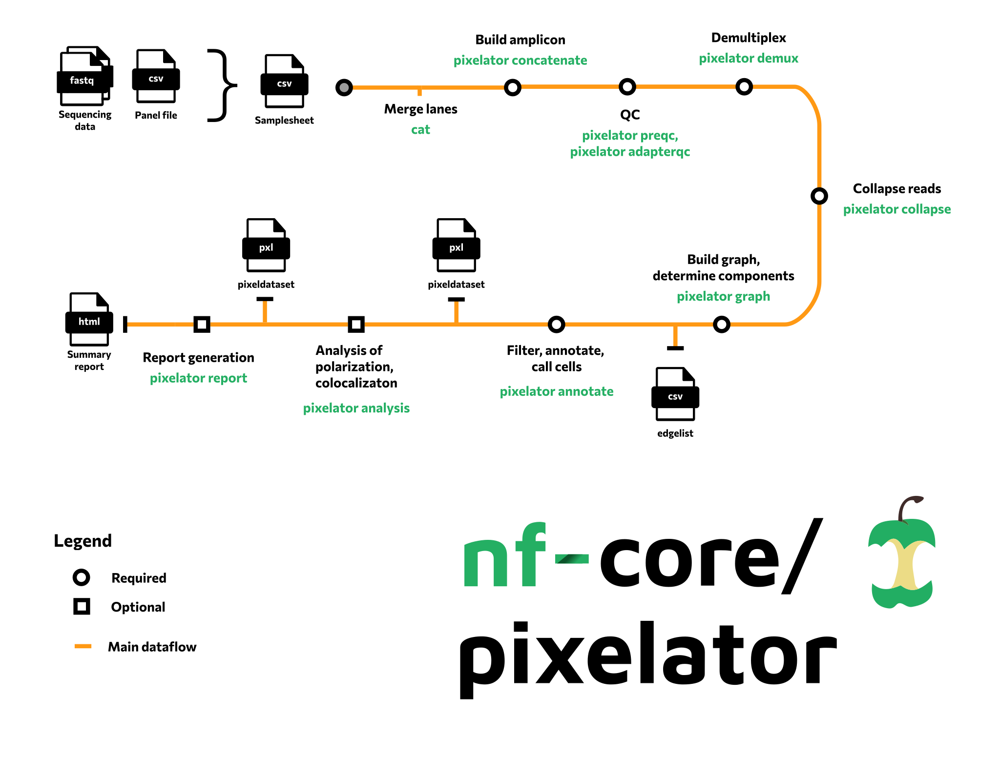

#  

[](https://github.com/nf-core/pixelator/actions/workflows/ci.yml)
[](https://github.com/nf-core/pixelator/actions/workflows/linting.yml)
[](https://nf-co.re/pixelator/results)[](https://doi.org/10.5281/zenodo.XXXXXXX)

[](https://www.nextflow.io/)
[](https://docs.conda.io/en/latest/)
[](https://www.docker.com/)
[](https://sylabs.io/docs/)
[](https://tower.nf/launch?pipeline=https://github.com/nf-core/pixelator)

[](https://nfcore.slack.com/channels/pixelator)[](https://twitter.com/nf_core)[](https://mstdn.science/@nf_core)[](https://www.youtube.com/c/nf-core)

## Introduction

**nf-core/pixelator** is a bioinformatics best-practice analysis pipeline for analysis of Molecular Pixelation assays.
It takes a samplesheet as input and will process your data using `pixelator` to produce final antibody counts.



1. Build amplicon from input reads ([`pixelator amplicon`](https://github.com/PixelgenTechnologies/pixelator))
2. Read QC and filtering, correctness of the pixel binding sequence sequences ([`pixelator preqc | pixelator adapterqc`](https://github.com/PixelgenTechnologies/pixelator))
3. Assign a marker (barcode) to each read ([`pixelator demux`](https://github.com/PixelgenTechnologies/pixelator))
4. Error correction, duplicate removal, compute read counts ([`pixelator collapse`](https://github.com/PixelgenTechnologies/pixelator))
5. Compute the components of the graph from the edge list in order to create putative cells ([`pixelator graph`](https://github.com/PixelgenTechnologies/pixelator))
6. Call and annotate cells ([`pixelator annotate`](https://github.com/PixelgenTechnologies/pixelator))
7. Analyze the cells for polarization and colocalization ([`pixelator analysis`](https://github.com/PixelgenTechnologies/pixelator))
8. Report generation ([`pixelator report`](https://github.com/PixelgenTechnologies/pixelator))

## Usage

> **Note**
> If you are new to Nextflow and nf-core, please refer to [this page](https://nf-co.re/docs/usage/installation) on how
> to set-up Nextflow. Make sure to [test your setup](https://nf-co.re/docs/usage/introduction#how-to-run-a-pipeline)
> with `-profile test` before running the workflow on actual data.

First, prepare a samplesheet with your input data that looks as follows:

`samplesheet.csv`:

```csv
sample,design,panel,fastq_1,fastq_2
uropod_control,D21,human-sc-immunology-spatial-proteomics,uropod_control_300k_S1_R1_001.fastq.gz,uropod_control_300k_S1_R2_001.fastq.gz
```

Each row represents a sample and gives the design, a panel file and the input fastq files.

Now, you can run the pipeline using:

```bash
nextflow run nf-core/pixelator \
   -profile <docker/singularity/.../institute> \
   --input samplesheet.csv \
   --outdir <OUTDIR>
```

> **Warning:**
> Please provide pipeline parameters via the CLI or Nextflow `-params-file` option. Custom config files including those
> provided by the `-c` Nextflow option can be used to provide any configuration _**except for parameters**_;
> see [docs](https://nf-co.re/usage/configuration#custom-configuration-files).

For more details and further functionality, please refer to the [usage documentation](https://nf-co.re/pixelator/usage) and the [parameter documentation](https://nf-co.re/pixelator/parameters).

## Pipeline output

To see the results of an example test run with a full size dataset refer to the [results](https://nf-co.re/pixelator/results) tab on the nf-core website pipeline page.
For more details about the output files and reports, please refer to the
[output documentation](https://nf-co.re/pixelator/output).

## Credits

nf-core/pixelator was originally written for [Pixelgen Technologies AB](https://www.pixelgen.com/) by:

- Florian De Temmerman
- Johan Dahlberg
- Alvaro Martinez Barrio

<!-- TODO nf-core: If applicable, make list of people who have also contributed -->

## Contributions and Support

If you would like to contribute to this pipeline, please see the [contributing guidelines](.github/CONTRIBUTING.md).

For further information or help, don't hesitate to get in touch on the [Slack `#pixelator` channel](https://nfcore.slack.com/channels/pixelator) (you can join with [this invite](https://nf-co.re/join/slack)).

## Citations

<!-- TODO nf-core: Add citation for pipeline after first release. Uncomment lines below and update Zenodo doi and badge at the top of this file. -->
<!-- If you use  nf-core/pixelator for your analysis, please cite it using the following doi: [10.5281/zenodo.XXXXXX](https://doi.org/10.5281/zenodo.XXXXXX) -->

An extensive list of references for the tools used by the pipeline can be found in the [`CITATIONS.md`](CITATIONS.md) file.

You can cite the `nf-core` publication as follows:

> **The nf-core framework for community-curated bioinformatics pipelines.**
>
> Philip Ewels, Alexander Peltzer, Sven Fillinger, Harshil Patel, Johannes Alneberg, Andreas Wilm, Maxime Ulysse Garcia, Paolo Di Tommaso & Sven Nahnsen.
>
> _Nat Biotechnol._ 2020 Feb 13. doi: [10.1038/s41587-020-0439-x](https://dx.doi.org/10.1038/s41587-020-0439-x).
