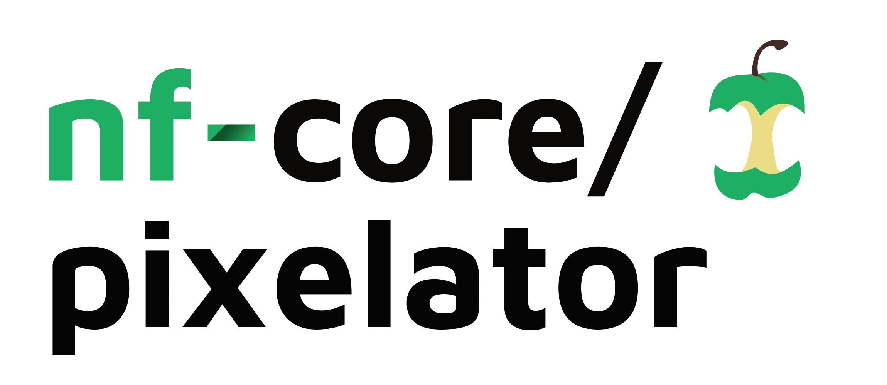
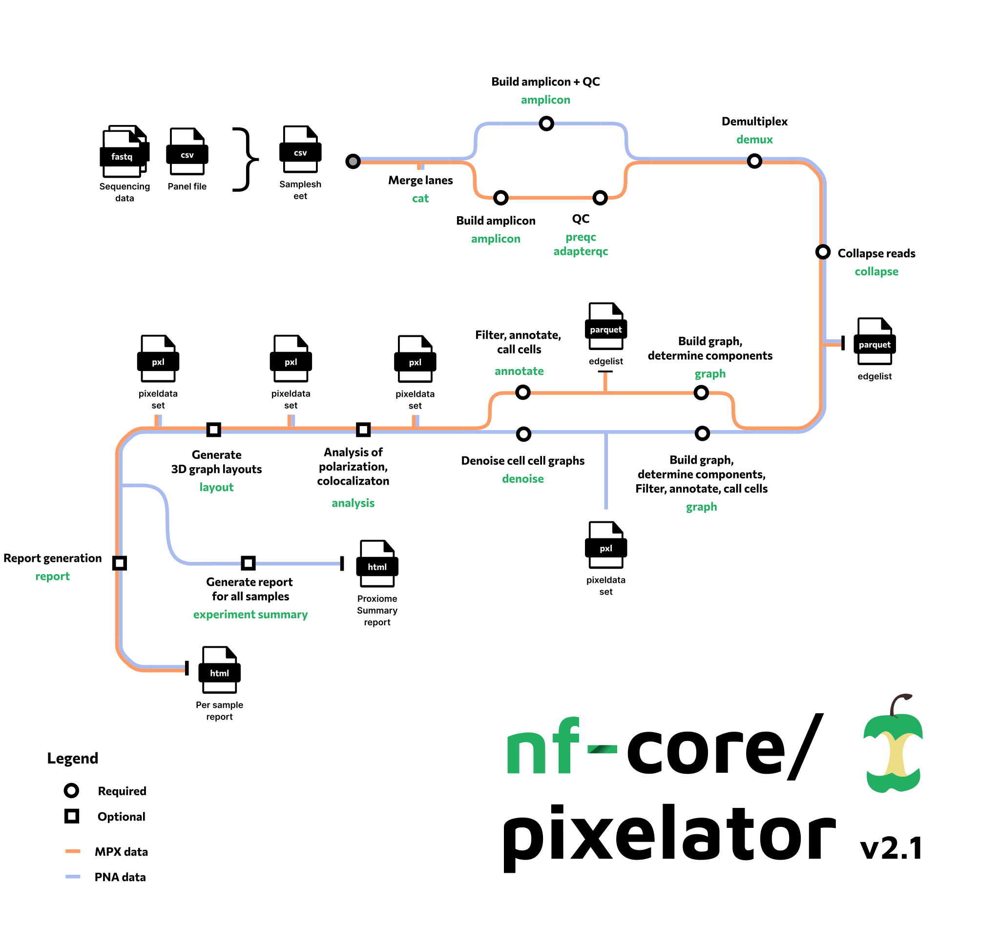

<h1>
  <picture>
    <source media="(prefers-color-scheme: dark)" srcset="docs/images/nf-core-pixelator_logo_dark.png">
    
  </picture>
</h1>

[](https://github.com/codespaces/new/nf-core/pixelator)
[](https://github.com/nf-core/pixelator/actions/workflows/nf-test.yml)
[](https://github.com/nf-core/pixelator/actions/workflows/linting.yml)
[](https://nf-co.re/pixelator/results)
[](https://doi.org/10.5281/zenodo.10015112)
[](https://www.nf-test.com)

[](https://www.nextflow.io/)
[](https://github.com/nf-core/tools/releases/tag/3.4.1)
[](https://docs.conda.io/en/latest/)
[](https://www.docker.com/)
[](https://sylabs.io/docs/)
[](https://cloud.seqera.io/launch?pipeline=https://github.com/nf-core/pixelator)

[](https://nfcore.slack.com/channels/pixelator)[](https://bsky.app/profile/nf-co.re)[](https://mstdn.science/@nf_core)[](https://www.youtube.com/c/nf-core)

## Introduction

**nf-core/pixelator** is a bioinformatics best-practice analysis pipeline for analysis of data from the
Molecular Pixelation (MPX) and Proximity Network (PNA) assays. It takes a samplesheet as input and will process your data
using `pixelator` to produce a PXL file containing single-cell protein abundance and protein interactomics data.



Depending on the input data the pipeline will run different steps.

For PNA data, the pipeline will run the following steps:

1. Do quality control checks of input reads and build amplicons ([`pixelator single-cell-pna amplicon`](https://github.com/PixelgenTechnologies/pixelator))
2. Create groups of amplicons based on their marker assignments ([`pixelator single-cell-pna demux`](https://github.com/PixelgenTechnologies/pixelator))
3. Derive original molecules to use as edge list downstream by error correcting, and counting input amplicons ([`pixelator single-cell-pna collapse`](https://github.com/PixelgenTechnologies/pixelator))
4. Compute the components of the graph from the edge list in order to create putative cells ([`pixelator single-cell-pna graph`](https://github.com/PixelgenTechnologies/pixelator))
5. Denoise the cell graphs ([`pixelator single-cell-pna denoise`](https://github.com/PixelgenTechnologies/pixelator))
6. Analyze the spatial information in the cell graphs ([`pixelator single-cell-pna analysis`](https://github.com/PixelgenTechnologies/pixelator))
7. Generate 3D graph layouts for visualization of cells ([`pixelator single-cell-pna layout`](https://github.com/PixelgenTechnologies/pixelator))
8. Report generation ([`pixelator single-cell-pna report`](https://github.com/PixelgenTechnologies/pixelator))

For MPX data, the pipeline will run the following steps:

1. Build an amplicons from the input reads ([`pixelator single-cell-mpx amplicon`](https://github.com/PixelgenTechnologies/pixelator))
2. Read QC and filtering, correctness of the pixel binding sequence sequences ([`pixelator single-cell-mpx preqc | pixelator adapterqc`](https://github.com/PixelgenTechnologies/pixelator))
3. Assign a marker (barcode) to each read ([`pixelator single-cell-mpx demux`](https://github.com/PixelgenTechnologies/pixelator))
4. Error correction, duplicate removal, compute read counts ([`pixelator single-cell-mpx collapse`](https://github.com/PixelgenTechnologies/pixelator))
5. Compute the components of the graph from the edge list in order to create putative cells ([`pixelator single-cell-mpx graph`](https://github.com/PixelgenTechnologies/pixelator))
6. Call and annotate cells ([`pixelator single-cell-mpx annotate`](https://github.com/PixelgenTechnologies/pixelator))
7. Analyze the cells for polarization and colocalization ([`pixelator single-cell-mpx analysis`](https://github.com/PixelgenTechnologies/pixelator))
8. Generate 3D graph layouts for visualization of cells ([`pixelator single-cell-mpx layout`](https://github.com/PixelgenTechnologies/pixelator))
9. Report generation ([`pixelator single-cell-mpx report`](https://github.com/PixelgenTechnologies/pixelator))

> [!WARNING]
> Since Nextflow 23.07.0-edge, Nextflow no longer mounts the host's home directory when using Apptainer or Singularity.
> This causes issues in some dependencies. As a workaround, you can revert to the old behavior by setting the environment variable
> `NXF_APPTAINER_HOME_MOUNT` or `NXF_SINGULARITY_HOME_MOUNT` to `true` in the machine from which you launch the pipeline.

## Usage

> [!NOTE]
> If you are new to Nextflow and nf-core, please refer to [this page](https://nf-co.re/docs/usage/installation) on how to set-up Nextflow. Make sure to [test your setup](https://nf-co.re/docs/usage/introduction#how-to-run-a-pipeline) with `-profile test` before running the workflow on actual data.

First, prepare a samplesheet with your input data that looks as follows (the exact values you need to input depend on the design and panel you are using):

`samplesheet.csv`:

```csv
sample,sample_alias,condition,design,panel,fastq_1,fastq_2
sample1,s1,control,pna-2,proxiome-immuno-155,sample1_R1_001.fastq.gz,sample1_R2_001.fastq.gz
```

Each row represents a sample and gives the design, a panel file and the input fastq files.

Now, you can run the pipeline using:

```bash
nextflow run nf-core/pixelator \
   -profile <docker/singularity/.../institute> \
   --input samplesheet.csv \
   --outdir <OUTDIR>
```

> [!WARNING]
> This version of the pipeline does not support conda environments, due to issues with upstream dependencies.
> This means you cannot use the `conda` and `mamba` profiles. Please use `docker` or `singularity` instead.
> We hope to add support for conda environments in the future.

> [!WARNING]
> Please provide pipeline parameters via the CLI or Nextflow `-params-file` option. Custom config files including those provided by the `-c` Nextflow option can be used to provide any configuration _**except for parameters**_; see [docs](https://nf-co.re/docs/usage/getting_started/configuration#custom-configuration-files).

For more details and further functionality, please refer to the [usage documentation](https://nf-co.re/pixelator/usage) and the [parameter documentation](https://nf-co.re/pixelator/parameters).

## Pipeline output

To see the results of an example test run with a full size dataset refer to the [results](https://nf-co.re/pixelator/results) tab on the nf-core website pipeline page.
For more details about the output files and reports, please refer to the
[output documentation](https://nf-co.re/pixelator/output).

## Credits

nf-core/pixelator was originally written for [Pixelgen Technologies AB](https://www.pixelgen.com/) by:

- Florian De Temmerman
- Johan Dahlberg
- Alvaro Martinez Barrio

## Contributions and Support

If you would like to contribute to this pipeline, please see the [contributing guidelines](.github/CONTRIBUTING.md).

For further information or help, don't hesitate to get in touch on the [Slack `#pixelator` channel](https://nfcore.slack.com/channels/pixelator) (you can join with [this invite](https://nf-co.re/join/slack)).

## Citations

If you use nf-core/pixelator for your analysis, please cite it using the following doi: [10.5281/zenodo.10015112](https://doi.org/10.5281/zenodo.10015112)

An extensive list of references for the tools used by the pipeline can be found in the [`CITATIONS.md`](CITATIONS.md) file.

You can cite the `nf-core` publication as follows:

> **The nf-core framework for community-curated bioinformatics pipelines.**
>
> Philip Ewels, Alexander Peltzer, Sven Fillinger, Harshil Patel, Johannes Alneberg, Andreas Wilm, Maxime Ulysse Garcia, Paolo Di Tommaso & Sven Nahnsen.
>
> _Nat Biotechnol._ 2020 Feb 13. doi: [10.1038/s41587-020-0439-x](https://dx.doi.org/10.1038/s41587-020-0439-x).

You can cite the molecular pixelation technology as follows:

> **Molecular pixelation: spatial proteomics of single cells by sequencing.**
>
> Filip Karlsson, Tomasz Kallas, Divya Thiagarajan, Max Karlsson, Maud Schweitzer, Jose Fernandez Navarro, Louise Leijonancker, Sylvain Geny, Erik Pettersson, Jan Rhomberg-Kauert, Ludvig Larsson, Hanna van Ooijen, Stefan Petkov, Marcela González-Granillo, Jessica Bunz, Johan Dahlberg, Michele Simonetti, Prajakta Sathe, Petter Brodin, Alvaro Martinez Barrio & Simon Fredriksson
>
> _Nat Methods._ 2024 May 08. doi: [10.1038/s41592-024-02268-9](https://doi.org/10.1038/s41592-024-02268-9)
